# iOS - MailCore2 安装教程
How to install MailCore2 with iOS 

[原文](http://kalvar-kaki.blogspot.com/2013/08/ios-mailcore2_10.html)

MailCore2是做OSX/iOS 二种 email手法的神器，真的很感激有这么棒的 Open Source 造福世界

[GitHub ( MailCore2 )](https://github.com/MailCore/mailcore2)

步骤如下

## [1]. 

新增 Security.framework, CFNetwork.framework

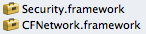

## [2].

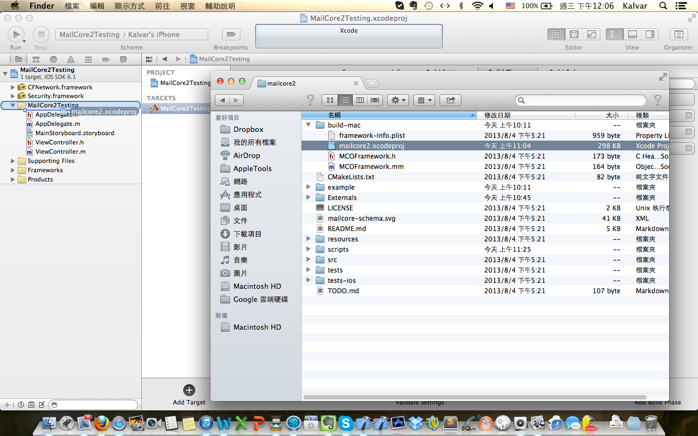

## [3].

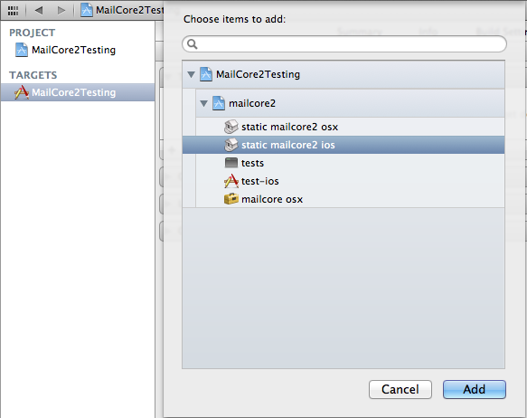

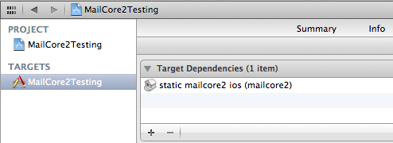

## [4].

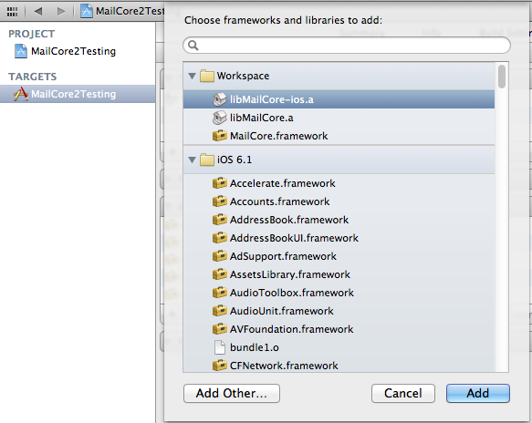

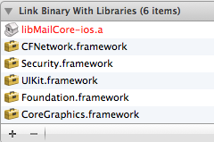

## [5].

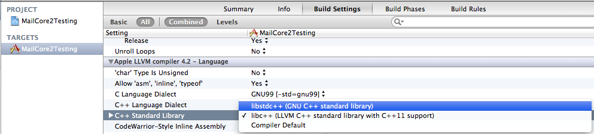

## [6].

寻找 Other Linker Flags，并直接贴上 : 

	-lctemplate-ios -letpan-ios -licudata -licui18n -licuuc -lxml2 -lsasl2 -liconv -ltidy -lz -lstdc++ -stdlib=libstdc++ -ObjC

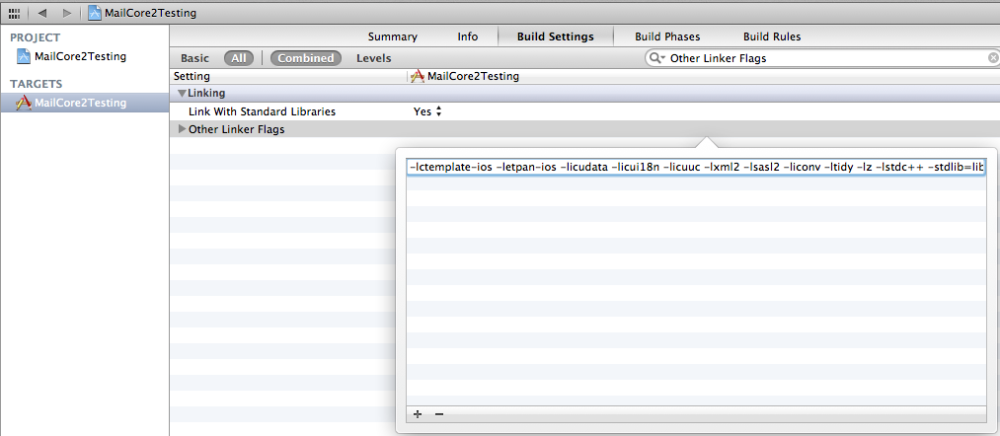

## [7]. 

如果 Library Linker Flags 里面有值，就记得刪除

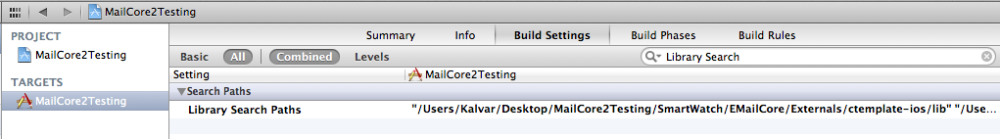

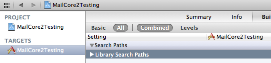

## [8]. 

先按下 command + B 进行 Build

此时请耐心等待，最久可长达 1 小時，因为 Xcode 正在从网络上抓相关联的 Source ( 例如 *.a  ) 下来至 App里。

可到这里來看 Build 的进度 :

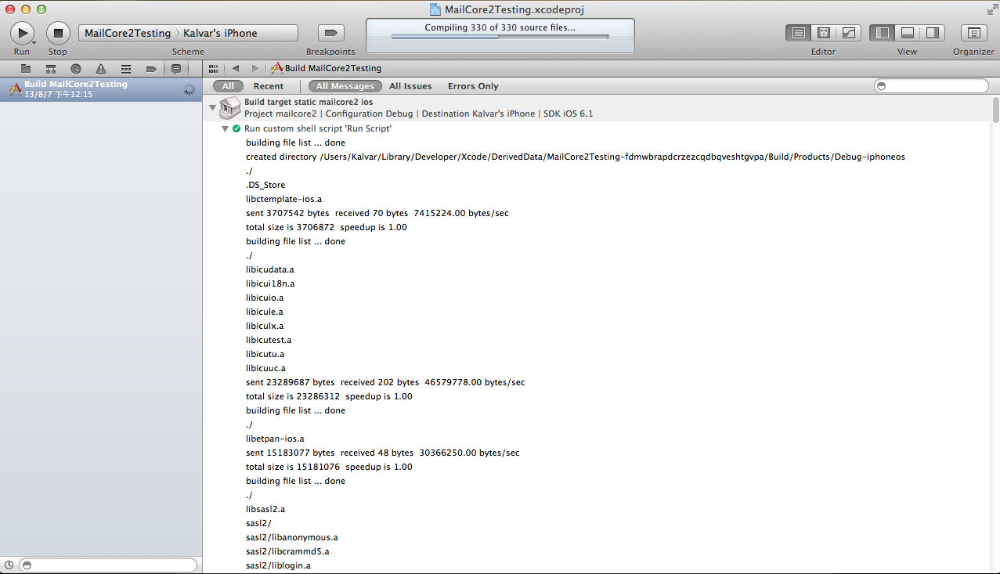  

## [9]. 

之后到 App 根目目录检查是否档案已下载齐全

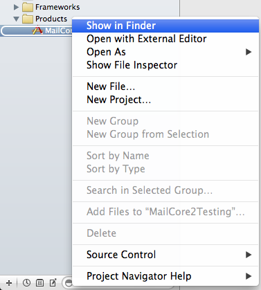

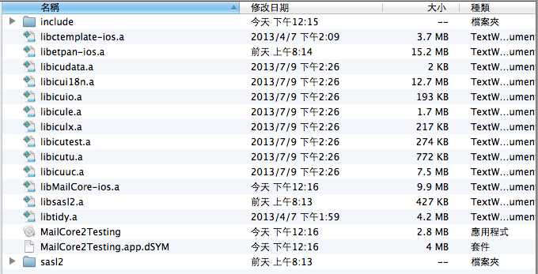

## [10].

最后就能开始引入头文件，进行 Coding

	#import <MailCore/MailCore.h> 

end.